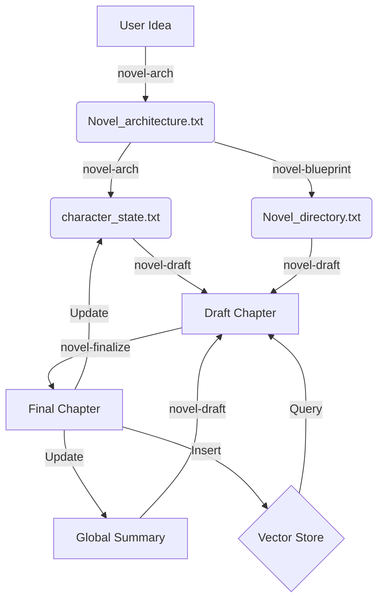

# Novel Generator Skill 核心指导文档

**版本**: v4.0 (Agent-Centric)
**适用对象**: 开发者、高级用户、AI 代理架构师

---

## 1. 设计哲学 (Philosophy)

本 Skill 采用 **Agent-Centric (代理人为中心)** 的架构设计。这与传统的 **Script-Centric (脚本为中心)** 自动化工具有着本质区别。

### 1.1 核心理念：大脑回归
*   **传统模式**: Python 脚本是“大脑”，它拼接 Prompt，调用 LLM API，处理返回。Agent 只是一个触发脚本的“按钮”。
    *   *缺点*: 灵活性差，修改 Prompt 需要改代码，无法利用 Agent 的实时思考能力。
*   **本 Skill 模式**: **Agent 是“大脑”**。Subagent (如 `novel-draft`) 直接理解用户意图，读取项目文件，自主构思，直接撰写内容。Python 脚本退化为纯粹的“手脚”（工具），只负责 Agent 做不到的事（如向量库索引、复杂文件校验）。

### 1.2 创作范式：结构先行 (Structure First)
目前默认采用 **雪花写作法 (Snowflake Method)** + **三幕式结构 (Three-Act Structure)** 的混合范式。
*   **分层推进**: 核心种子 -> 角色动力学 -> 世界观 -> 章节蓝图 -> 正文。
*   **状态追踪**: 既然是长篇，必须有“记忆”。我们通过 `global_summary.txt` (剧情记忆) 和 `character_state.txt` (状态记忆) 来维护连贯性。
*   **RAG 增强**: 利用向量数据库 (`vector_store.py`) 存储海量设定和背景，解决 LLM 上下文窗口限制。

---

## 2. 核心工作流 (Workflow)

整个创作过程被拆解为一系列独立的 Agent 任务，通过文件系统进行状态传递。

### 流程图

### 详细步骤说明

#### Step 1: 架构设计 (`novel-arch`)
*   **输入**: 用户的一个点子或模糊意向。
*   **Agent 动作**:
    1.  交互式询问，确定主题类型。
    2.  执行雪花法推导（种子->角色->世界->大纲）。
*   **输出**: `Novel_architecture.txt` (骨架), `character_state.txt` (初始状态)。

#### Step 2: 蓝图规划 (`novel-blueprint`)
*   **输入**: 架构文件。
*   **Agent 动作**:
    1.  理解三幕式结构。
    2.  规划节奏曲线（悬念单元）。
    3.  分块生成详细的章节目录。
*   **输出**: `Novel_directory.txt` (每章的详细Brief)。

#### Step 3: 章节撰写 (`novel-draft`)
*   **输入**: 目录、设定、前文摘要、角色状态。
*   **Agent 动作**:
    1.  **RAG**: 调用 `vector_store.py` 检索相关背景资料。
    2.  **Context**: 读取上一章结尾，确保衔接。
    3.  **Writing**: 结合所有信息，撰写正文。
*   **输出**: `chapters/chapter_N.txt` (草稿)。

#### Step 4: 定稿归档 (`novel-finalize`)
*   **输入**: 草稿。
*   **Agent 动作**:
    1.  **扩写** (可选): 如果字数不足，进行润色。
    2.  **提炼**: 生成本章摘要，更新 `global_summary.txt`。
    3.  **追踪**: 更新 `character_state.txt` (如某人受伤、获得道具)。
    4.  **记忆**: 调用工具将正文存入向量库。
*   **输出**: 更新后的状态文件和向量库。

---

## 3. 范式切换与扩展 (Paradigm Shift)

本 Skill 的高度模块化设计，使得切换写作范式变得非常简单。你不需要修改 Python 代码，**只需要修改 Subagent 的 Prompt 定义 (`.md` 文件)**。

### 场景 A: 切换为“英雄之旅” (The Hero's Journey)
*   **修改对象**: `agents/novel-arch.md`
*   **操作**:
    1.  打开 `novel-arch.md`。
    2.  找到 `## 工作流程` -> `Phase 2`。
    3.  将“雪花法”步骤替换为“英雄之旅”步骤：
        *   Step 1: 平凡世界 (The Ordinary World)
        *   Step 2: 冒险召唤 (Call to Adventure)
        *   ...
        *   Step 12: 满载而归 (Return with the Elixir)
*   **结果**: Agent 思考逻辑变了，生成的 `Novel_architecture.txt` 结构随之改变，但后续流程（写稿、定稿）依然兼容。

### 场景 B: 切换为“发现式写作” (Pantser / Discovery Writing)
*   **修改对象**: `agents/novel-blueprint.md` 和 `agents/novel-draft.md`
*   **操作**:
    1.  **弱化蓝图**: 修改 `novel-blueprint.md`，不再强制生成全书目录，而是只生成“下一卷”或“下三章”的简要方向。
    2.  **强化Draft**: 修改 `novel-draft.md`，指示 Agent 更多依赖“角色当前状态”和“随机性”来推动剧情，而不是死板遵循目录 Brief。

### 场景 C: 增加“设定集”驱动 (Lore-Driven)
*   **修改对象**: `agents/novel-arch.md`
*   **操作**:
    1.  在架构生成前，强制要求 Agent 先读取用户提供的海量设定文件（通过 `novel-knowledge-import` 导入的）。
    2.  Prompt 指令改为：“请基于向量库中已有的庞大世界观，推导出一个适合该世界的故事线。”

---

## 4. 关键文件清单

### Agent 定义 (大脑)
位于 `.opencode/agents/`:
*   `novel-arch.md`: 架构师
*   `novel-blueprint.md`: 策划
*   `novel-draft.md`: 作家
*   `novel-finalize.md`: 编辑
*   `novel-consistency.md`: 审校

### 工具脚本 (手脚)
位于 `.opencode/skill/novel-generator/scripts/`:
*   `vector_store.py`: 向量库 CRUD (基于 FAISS/Chroma)。
*   `workflow_check.py`: 完整性检查。
*   `asset_manager.py`: 模板注入。

### 项目文件 (记忆)
位于用户项目目录:
*   `Novel_architecture.txt`: 静态长时记忆 (核心设定)。
*   `global_summary.txt`: 动态长时记忆 (剧情梗概)。
*   `character_state.txt`: 动态状态记忆 (RPG式状态表)。
*   `.novel_data/vector_store/`: 检索型记忆 (海量细节)。
